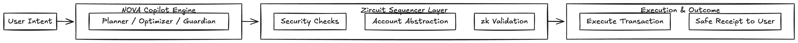

# 🌌 NOVA — The AI Copilot that onboarded the world

> **NOVA is the Cognitive Finance Copilot built on Zircuit.**  
It turns user intent into seamless financial action by combining AI-native intelligence, sequencer-level security, account abstraction, and zk scalability.  
NOVA turns fragmented transactions into a single human intent — guiding users from desire to outcome as effortlessly as Google Maps guides you to a destination.

---

## 1. Problem Statement
DeFi promised freedom, but today it’s a labyrinth.  
- **Complexity**: bridging, farming, yield-hunting, gas juggling — every step is a maze.  
- **Exclusion**: billions are locked out not because they lack capital, but because crypto demands the mind of an engineer.  
- **Trust Gap**: even experienced users hesitate, knowing one wrong click can derail them.  

Mass adoption isn’t blocked by regulation or liquidity — it’s blocked by usability. Until DeFi becomes simple, safe, and human, it will never onboard the world.  

---

## 2. Solution: NOVA Copilot
NOVA is the first **AI-native financial copilot**.  
Users don’t think in transactions — they speak in **intents**:  
- “Bridge 1 ETH to Solana, lowest fees.”  
- “Earn 5% yield, safely.”  
- “Swap into USDC and hedge volatility.”  

NOVA translates intent → into **optimal, secure, Zircuit-powered execution**.  

### Why NOVA is only possible on **Zircuit**  

NOVA is not just deployed on Zircuit, it is born from it. Every pillar of NOVA depends on Zircuit’s DNA:  

- **Sequencer-Level Security** → NOVA’s copilots can’t guide users without a safe sandbox. Only Zircuit lets intents be simulated and quarantined *before* they ever touch a user’s wallet.  
- **Account Abstraction** → NOVA’s one-click, multi-step journeys are impossible on chains that still treat every action as a separate signature. Zircuit collapses the maze into a single, human confirmation.  
- **Hybrid zk Architecture** → For NOVA to serve billions, intents must settle fast and cheap at global scale. Zircuit’s zk compression makes cognitive finance not just possible, but inevitable.  
- **AI-native Design** → Zircuit isn’t a passive execution engine — it was architected to think alongside applications. NOVA’s intelligence plugs directly into this design.  

Ethereum, Solana, Polygon — they execute blindly. On Zircuit, the chain itself *thinks first, acts second*.  
That’s why NOVA could not exist anywhere else. On Zircuit, it was inevitable.    

---

## 3. Architecture
**Flow Diagram (textual)**  
  User Intent 
→ NOVA Agent Layer (AI copilots: Router, Optimizer, Protector)  
→ Sequencer Security Layer (fraud checks, simulation, zk validation)  
→ Zircuit Execution (fast, abstracted, finalized)  
→ User (safe, simple, successful result)  

**Flow Diagram (visual)**  

---

## 4. User Journey
**Before NOVA:**  
Alice wants to bridge 1 ETH to Solana. She must:  
- Find a safe bridge.  
- Compare fees across routes.  
- Risk a malicious contract.  
- Confirm multiple confusing signatures.  

**With NOVA:**  
Alice types: *“Bridge 1 ETH to Solana cheapest route.”*  
- NOVA Agent simulates all bridge routes.  
- Sequencer flags insecure options.  
- Account abstraction signs once.  
- Result: safe, cheapest execution in one click.  

NOVA reduces **15 minutes of stress → into 15 seconds of clarity**.  

---

## 5. Pitch Story
**Act I — The Jungle**  
DeFi promised freedom but delivered friction. A simple goal like “earn 5% safely” forces users into a labyrinth of bridges, farms, and signatures. Billions stay out not because they lack capital, but because crypto still speaks machine instead of human.  

**Act II — The Supernova**  
Zircuit changed the equation. With sequencer-level security, account abstraction, and zk scalability. And from this foundation, NOVA was born — the Copilot that translates human goals into flawless execution.

**Act III — The Copilot of Finance**  
NOVA isn’t another wallet or dApp. It’s the first system where the chain itself thinks with you: routing, optimizing, protecting, and delivering the outcome in a single confirmation. That’s why NOVA isn’t just a tool — it’s the supernova that lit the path to mass adoption. 

---

## 6. Why It Matters (Pillars)
- **Innovation** → Intent-based finance is the new paradigm.  
- **Inclusivity** → Unlocks billions excluded from crypto.  
- **Simplicity** → DeFi in one click.  
- **Intelligence** → Cognitive, AI-secured execution.  

** Market Reality Check:**  
- As of May 2025, over 27 million unique users interacted with DeFi—**4× year-over-year growth**—yet still a tiny fraction of global finance.  [oai_citation:3‡ScienceDirect](https://www.sciencedirect.com/science/article/pii/S0040162524000404?) 
- There are 14.2 million active DeFi wallets mid-2025, with weekly transaction volumes over **$48 billion**—potential is huge, but adoption remains narrow.  [oai_citation:5‡CoinLaw](https://coinlaw.io/decentralized-finance-market-statistics/?)  
- Shockingly, 90% of non-crypto owners say they *can’t use crypto because they lack understanding*, and 49% say they *don’t understand how it works*—proof that **friction, not access, holds people back**.  [oai_citation:6‡MarketWatch](https://www.marketwatch.com/story/heres-whats-preventing-the-majority-of-americans-from-getting-into-crypto-433c07d7?)

---

## 7. Future Expansion
- **NOVA Marketplace** → Specialized copilots (yield, bridge, hedge) built on Zircuit.  
- **NOVA Wallet** → Intent-native interface for mass adoption.  
- **NOVA Protocol** → The Apple Maps of Finance, the navigation layer for the entire ecosystem.  

---

## 8. One Sentence Description + Why Should I Win

NOVA is the Cognitive Finance Copilot on Zircuit that turns human intent into seamless financial action.

I should win because while others submit ideas, I’ve built a blueprint for the future: NOVA, the Copilot that will onboard billions by turning fragmented crypto transactions into human intent.

---

## 9. Team
I am Santiago — a solo hacker, but more importantly, a dreamer who builds with purpose. My background blends AI, crypto research, and innovative design, but my real strength lies in vision: taking what feels impossible and shaping it until it becomes inevitable.

For me, innovation, creativity, and intelligence aren’t just skills, they are who I am. NOVA is more than a project; it’s the proof of that identity. A Copilot not just built for crypto, but destined to redefine it.

---

## 10. Summary
**NOVA is the killer app that proves Zircuit’s destiny: not a chain, but the Cognitive Infrastructure of Finance.**  

This is not just an app. This is the supernova that will onboard the world.  

And soon, **DeFi without NOVA will feel like the internet without Google — or the world without maps. Unthinkable.**  
